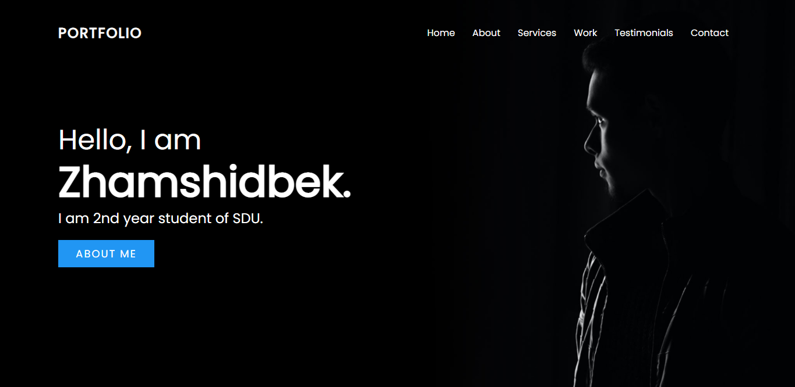
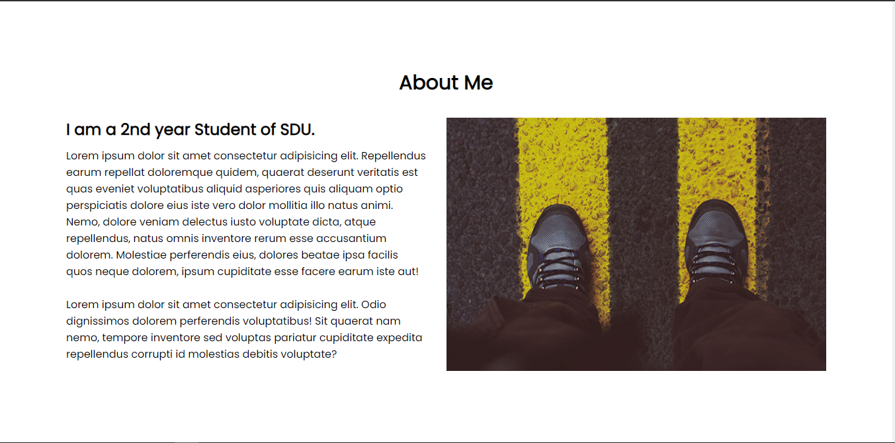
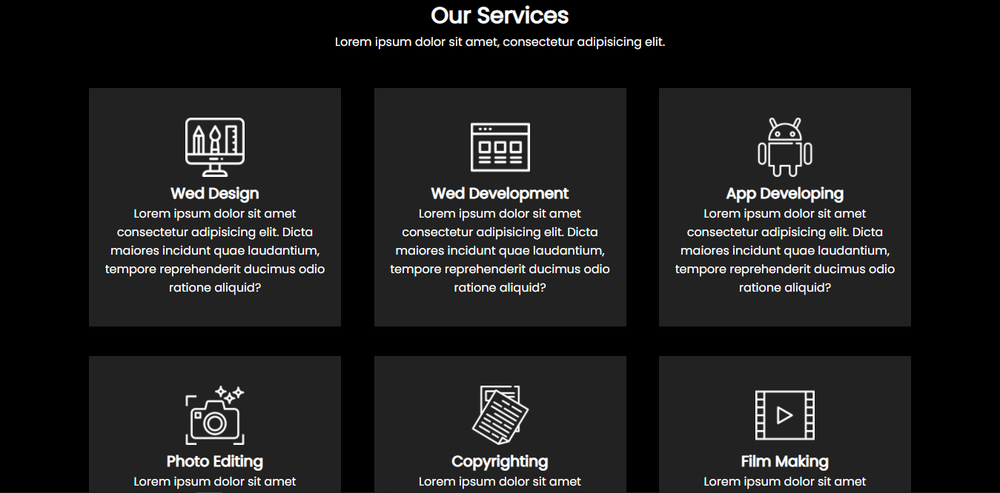
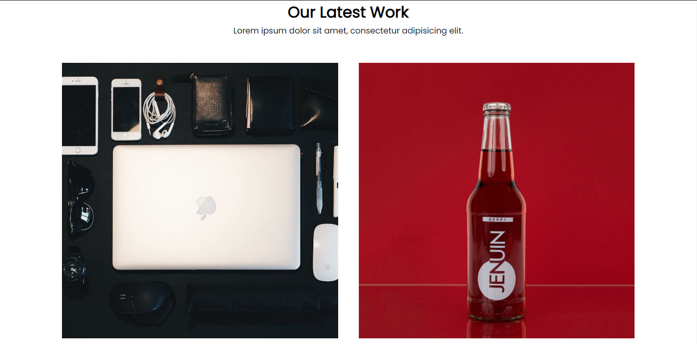
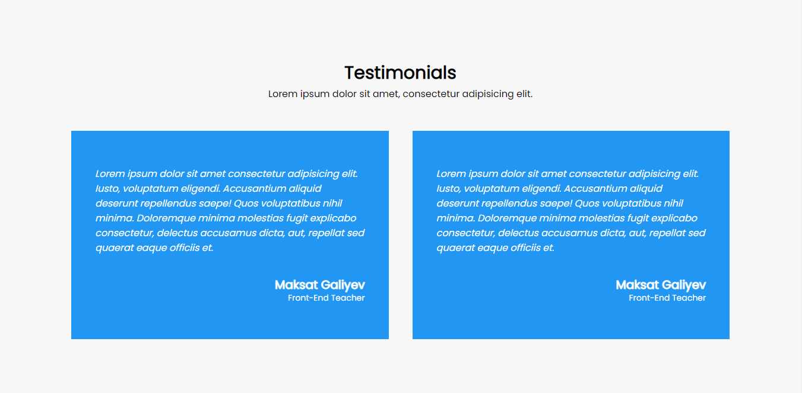
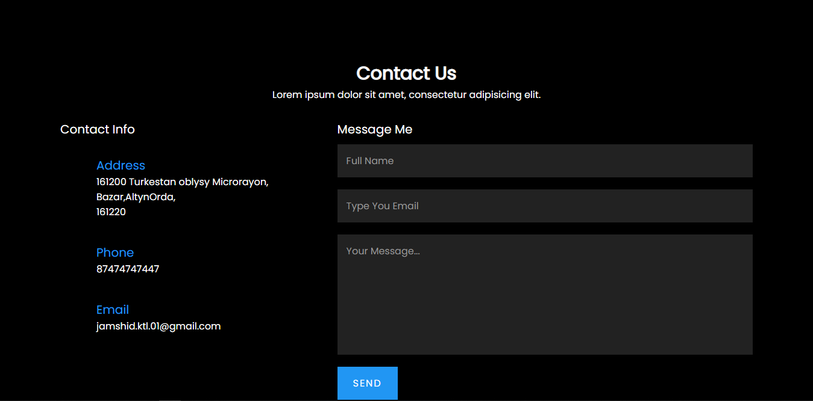
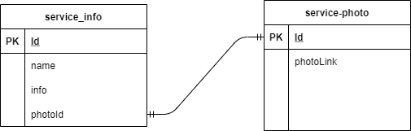

# About project

## Project Description
### In project there are many routes
### They are:
1. '/' - **Home route**

2. '/about' - **About route**

3. '/services' - **Services route**

4. '/work' - **Work Route**

5. '/testimonials' - **Testimonials route**

6. '/contact' - **Contacts route**

### Project has an many functionality like that `email Sending`, `file uploading` and etc.
### It has 2 tables which are `services-info` and `services-photo` they connects by service-info.photoId = service-photo.id
  
### Project has localization for `English`,`Russian` and `Kazakh`

## Project Purpose 
#### Main purpose of project that CV for developer. And user can interact with developer easily. And there is also one more purpose marketing of developer's services.